# azure-networking-lab-multitier
AZ-700 Multi-tier Azure VNet lab (NSGs, NICs, DNS, connectivity validation)
# Azure Networking Lab — Multi-Tier VNet Architecture (AZ-700)

## Overview
This lab documents a **Microsoft-style Azure network infrastructure** using a **multi-tier virtual network (VNet)** approach. It demonstrates **subnet segmentation**, **NIC-centric networking**, **Network Security Groups (NSGs)**, and **DNS + connectivity validation** using real VM traffic tests.

**Why this matters:** This mirrors how Azure Network Engineers design, secure, and validate enterprise networks in Azure.

---

## Objectives
- Validate Azure portal access and resource organization
- Confirm VNet/subnet architecture
- Verify NIC-centric deployment model
- Validate NSG-based traffic control
- Confirm **external DNS resolution** (internet outbound)
- Confirm **internal DNS resolution** (Azure internal DNS)
- Confirm **private IP connectivity** (east-west traffic)

---

## Environment (Example)
- **Resource Group:** `QueensTechRG`
- **Workloads:** `webvm`, `dnsvm`, `datavm`, `engvm`
- **Security:** NSGs applied per tier/workload
- **Public exposure:** Public IP assigned to **web tier only**

---

# Screenshot Walkthrough (Approved Set Only)

## 01 — Azure Portal Home
**What this proves:** Correct portal access, tenant/subscription context, and recent infrastructure visibility.
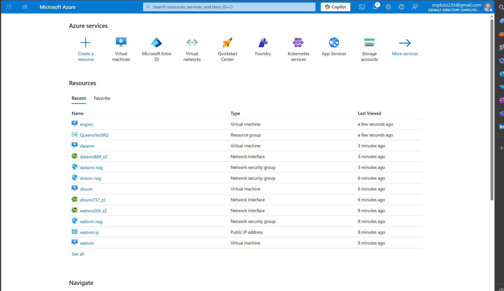

---

## 02 — Resource Group: QueensTechRG
**What this proves:** All resources are organized into a single lifecycle boundary for RBAC, cost, and cleanup.


---

## 03 — Virtual Network Overview
**What this proves:** The network boundary exists and supports subnet segmentation for multi-tier design.
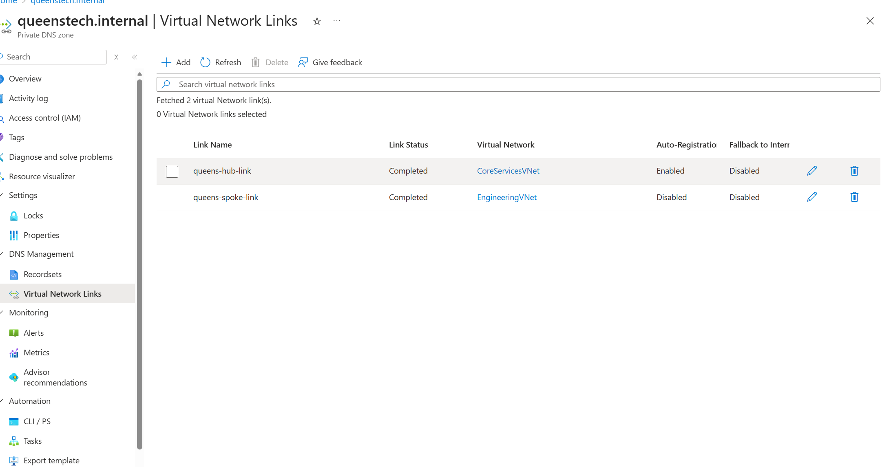

---

## 04 — Virtual Machines (Tiered Workloads)
**What this proves:** Multi-tier workloads are deployed (web/data/core services/engineering).
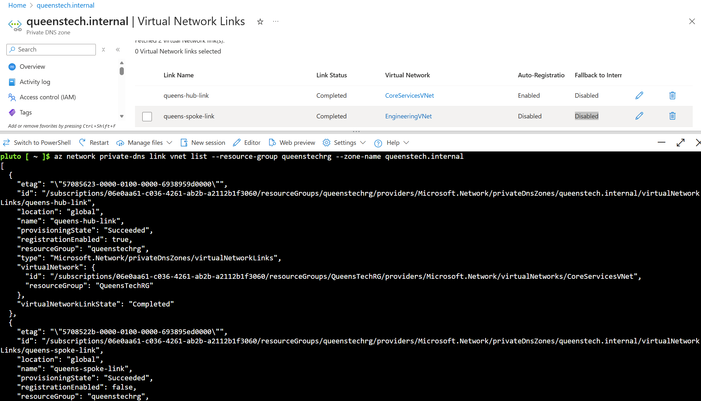

---

## 05 — Network Interfaces (NIC-Centric Networking)
**What this proves:** Azure networking is applied at the NIC level (IP configs, NSGs, routes, effective routes).
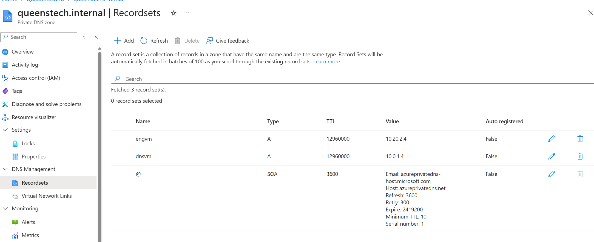

---

## 06 — Network Security Groups (NSGs)
**What this proves:** Workloads are protected using least-privilege network policy enforcement.
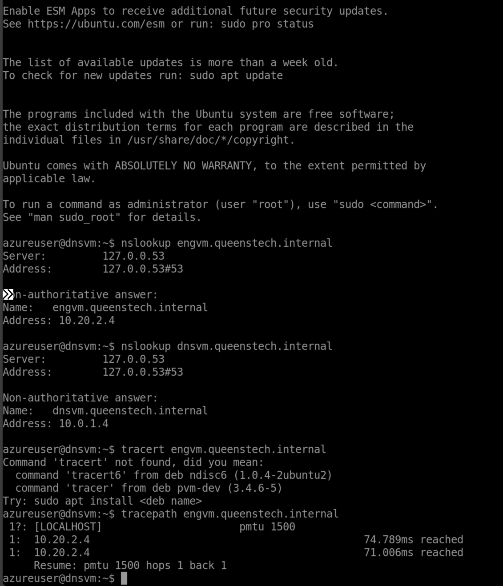

---

## 07 — Public IP (Web Tier Only)
**What this proves:** Only the web tier is internet-exposed, matching Microsoft best practice (minimize public endpoints).
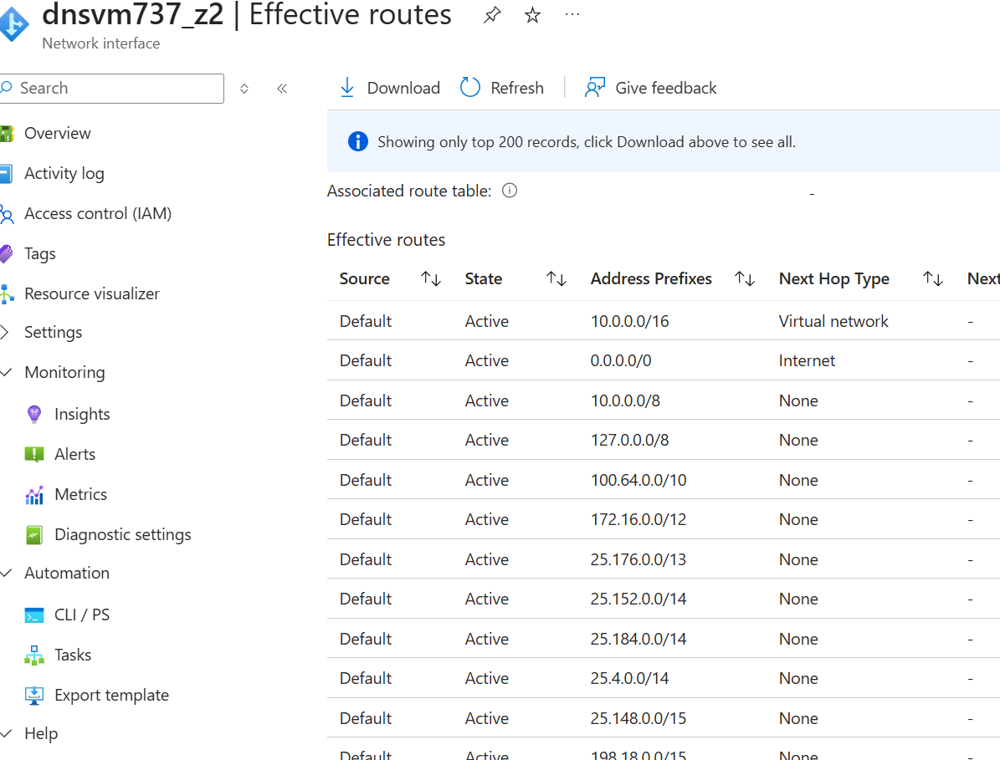

---

## 08 — Web VM Network Configuration
**What this proves:** Web tier NIC/subnet/IP configuration supports controlled inbound and outbound connectivity.
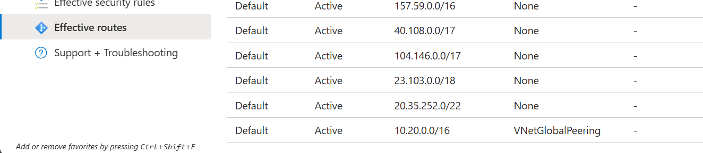

---

## 09 — DNS VM Network Configuration
**What this proves:** Core services workload is placed privately and supports internal name resolution patterns.
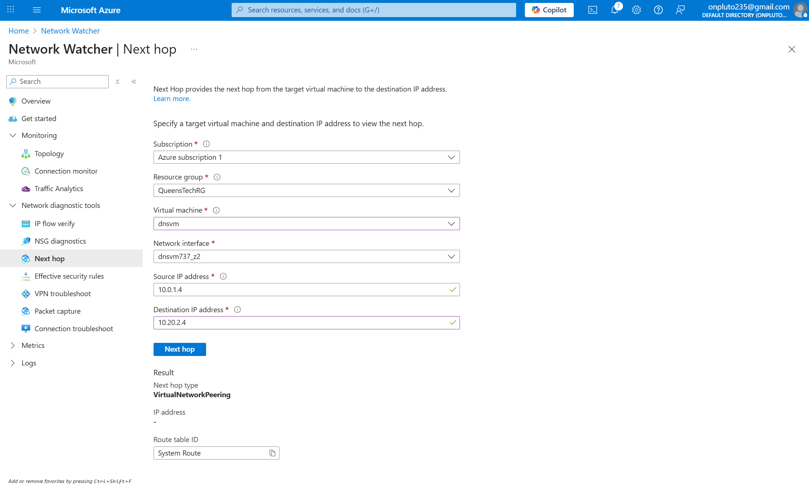

---

## 10 — Internal DNS Resolution (Azure Internal DNS)
**What this proves:** Internal hostname resolution works inside the VNet (Azure-provided DNS / internal.cloudapp.net).
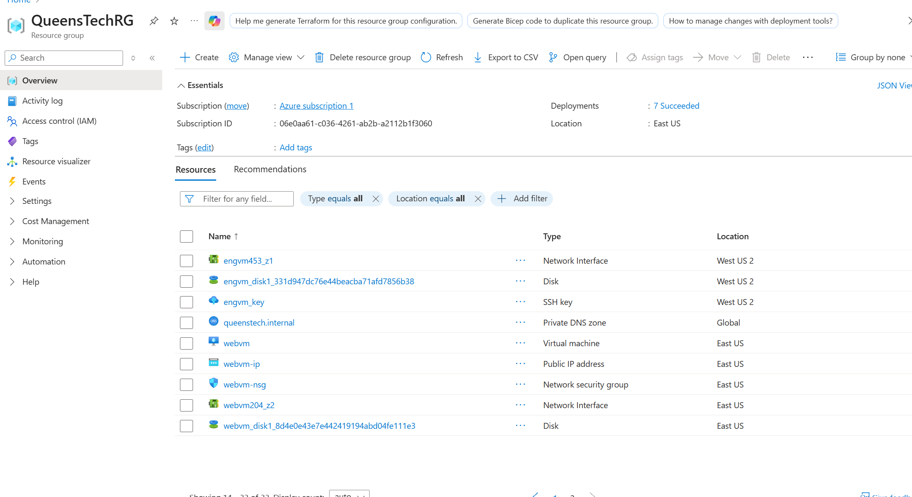

---

## 11 — Private IP Connectivity (East-West Traffic)
**What this proves:** VM-to-VM communication works over private IPs, confirming routing + NSG allowance.
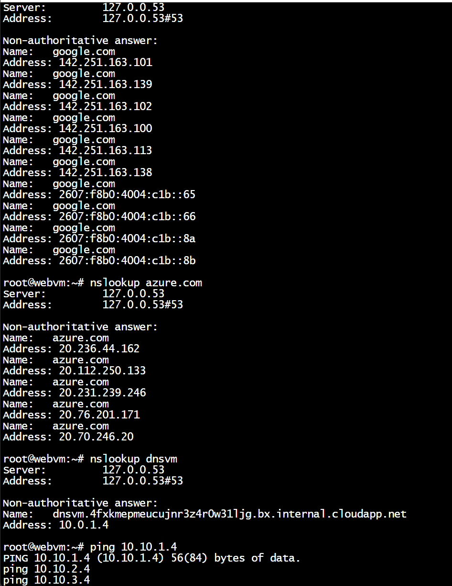

---

## 12 — External DNS Resolution (Internet Outbound)
**What this proves:** Outbound connectivity + DNS forwarding works (public domains resolve from inside the VM).
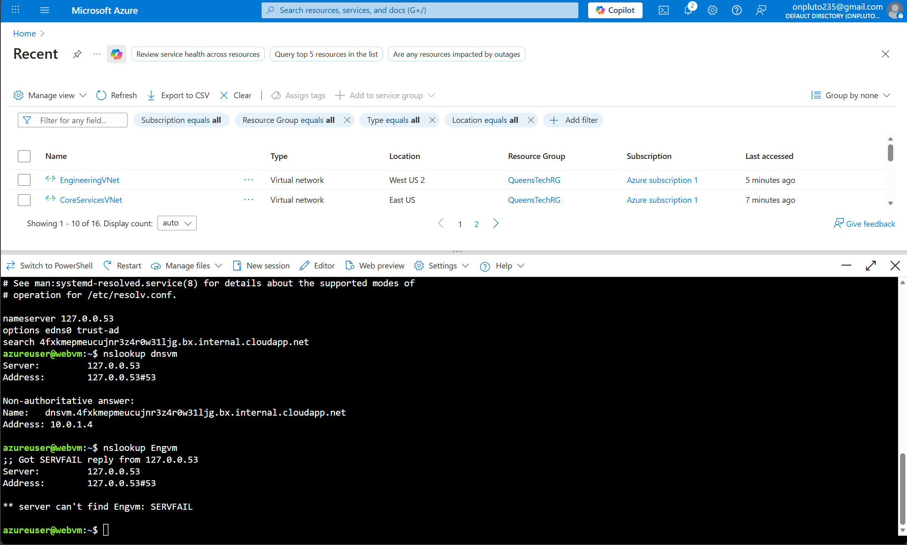

---

## Azure CLI Validation
```bash
# List VNets
az network vnet list -g QueensTechRG -o table

# List subnets
az network vnet subnet list -g QueensTechRG --vnet-name CoreServicesVNet -o table

# List NSGs
az network nsg list -g QueensTechRG -o table

# List NICs
az network nic list -g QueensTechRG -o table

# List Public IPs
az network public-ip list -g QueensTechRG -o table
